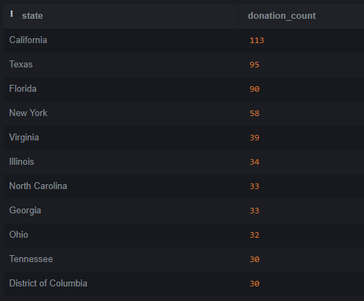
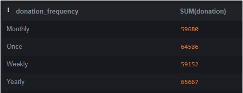
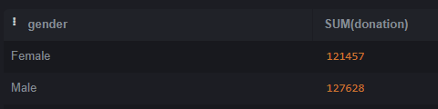
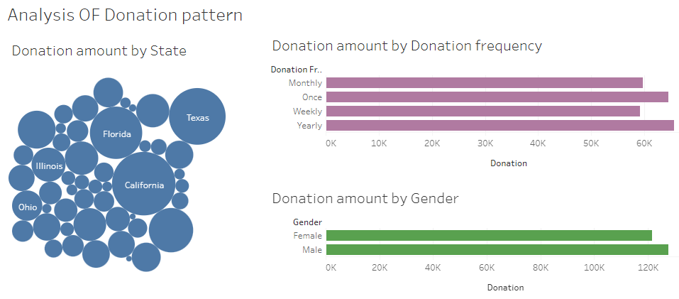

# Strategic Fundraising Plan - Analyzing Donation Patterns for an Educational Charity


---

## Table of Contents

- [Introduction](#introduction)
- [Project Overview](#project-overview)
- [Tools](#tools)
- [Data Design](#data-design)
- [Exploratory Data Analysis](#exploratory-data-analysis)
- [Insights](#insights)
- [Data Visualization](#data-visualization)
- [Findings and Recommendation](#findings-and-recommendation)
- [Additional Recommendation and Conclusion](#additional-recommendation-and-conclusion)


## Introduction

Charity is about building a better world, and there's no better way to do that than by equipping the younger generation with essential skills and resources. Educational charities play a vital role in ensuring a brighter future for children, even amidst global challenges. The Education For All Foundation is one such organization, offering free English education to underprivileged children worldwide. By connecting bilingual volunteers from North America and beyond with children in rural developing nations, the Foundation provides not only language skills but also emotional support, mentorship, and financial aid. Through its multi-cultural community of dedicated volunteers, the Foundation aims to empower these children, giving them the confidence to shape their own futures.

## Project Overview

This project focuses on analysing the donation patterns for the Education For All Charity Foundation, with the goal of developing a fundraising strategy to increase donations in the coming year. The foundation provides free English education to underprivileged children globally, aiming to empower them with the skills needed for a brighter future. The analysis involves studying donation and donor data to identify key trends and opportunities for increasing the number of donors, donation frequency, and donation amounts. Insights from this analysis will inform the creation of a targeted fundraising strategy to be presented at an upcoming fundraising strategy meeting. Data analysis was performed using SQL and visualized with Tableau, highlighting trends such as regional donation patterns, donor demographics, and donation behaviours.

## Tools

- SQLite
- Tableau

## Data Design

The dataset used for this analysis was stored as an SQL file. Two sources of data were collected: Donation data and Donor data. The Donation data includes Donor ID, First name, Last name, Email address, Gender, Job field, Donation amount, State of residence (US), and Donor shirt size. The Donor data contains Donor ID, Donation frequency, University attended, Car make, Second language, Favourite colour, and Favourite movie genre.

## Exploratory Data Analysis

EDA involves exploring the data to answer the following questions:
1.	Which state has the highest amount of donations?
2.	Which state has the highest number of donors?
3.	How frequently do donations come in (at once, yearly, monthly, and weekly)?
4.	Which gender has the highest amount of donations?
5.	Which job field has the highest amount of donations?

## Insights

**I began by joining the two datasets—the Donation data and the Donor data—in SQLite, using the query below:**

```sql
SELECT*
FROM Donation_Data
JOIN Donor_Data2
ON Donation_Data.id=Donor_Data2.id;
```

#### **Donation Amount by State**

```sql
SELECT state, SUM(donation)
FROM Donation_Data
group by state;
```

#### **Top States with 30 or more Donor**

```sql
SELECT state, COUNT(donation) AS donation_count
FROM Donation_Data
GROUP BY state
HAVING COUNT(donation) >= 30
ORDER BY donation_count DESC;
```

The table below highlights the states with 30 or more donors. Notably, California has the highest number of donors, followed by Texas, Florida, and other states.



#### **Donation Amount by Donation Frequency**

```sql
SELECT donation_frequency, SUM(donation)
FROM Donation_Data
JOIN Donor_Data2
ON Donation_Data.id = Donor_Data2.id
GROUP BY donation_frequency;
```



#### **Donation Amount by Gender**

```sql
SELECT gender, SUM(donation)
FROM Donation_Data
GROUP BY gender;
```



#### **Donation Amount by Job Field**

```sql
select job_field, SUM(donation)
FROM Donation_Data
GROUP BY job_field;
```

## Data Visualization



#### **Explore and interact with the rest of my visuals** [here](https://public.tableau.com/views/DevelopingaStrategicFundraisingPlanthroughAnalysisofDonationPatternsforanEducationalCharity_/Dashboard1?:language=en-US&:sid=&:redirect=auth&:display_count=n&:origin=viz_share_link)

## Findings and Recommendation

Based on the analysis, the following recommendations are proposed:

1. **Donation Frequency**: While annual and one-time donations constitute the largest share of contributions, it's essential to encourage more frequent donations, such as weekly and monthly contributions. Additionally, introducing daily donation options could further increase overall contributions.

2. **Donor Engagement**: Major donors often appreciate public recognition for their contributions. Since California, Texas, and Florida have the highest donation amounts and number of donors, it is recommended to engage these donors by promptly sending thank-you letters and small tokens of appreciation. This gesture of gratitude can foster stronger relationships and encourage future donations. Additionally, sharing thank-you videos from beneficiaries on social media can further motivate both existing and potential donors.

3. **Mobile Donations**: To maximize convenience and accessibility, it is advisable to offer mobile donation options. This allows supporters to contribute from anywhere at any time, making it easier for them to engage with the organization whenever they feel compelled to do so.


## Additional Recommendation and Conclusion

This analysis is crucial for evaluating the year's donations and developing a strategic fundraising plan for the following year. Key strategies to consider include:
-	**Optimize Your Website**: Ensure your website makes a strong first impression as it's often the first interaction potential donors have with your nonprofit.
-	**Motivate Fundraising Staff**: A dedicated team can identify major donors, partnership opportunities, and advocates who align with your mission.
-	**Develop a Clear Case for Support**: A well-articulated plan for how donations will be used not only motivates donors but also equips staff and volunteers with a strong pitch.
-	**Implement Donor Recognition Programs**: Encourage peer-to-peer fundraising campaigns to expand your reach through the networks of your current supporters.
-	**Utilize Social Media Advertising**: With Facebook reaching over 81% of the US digital population, running targeted ads on social media can significantly boost visibility.
-	**Make Donations Shareable**: Facilitate easy sharing of donations on platforms like Facebook, Twitter, and Instagram to encourage others to contribute.
-	**Explicitly Ask for Donations**: Always clearly request donations in your appeals to avoid any ambiguity.
-	**Leverage Celebrity Endorsements**: Research and connect with celebrities who support causes similar to yours to amplify your message.
-	**Embrace Innovation**: Keep your fundraising fresh by exploring new engagement opportunities to maintain donor interest and involvement.


